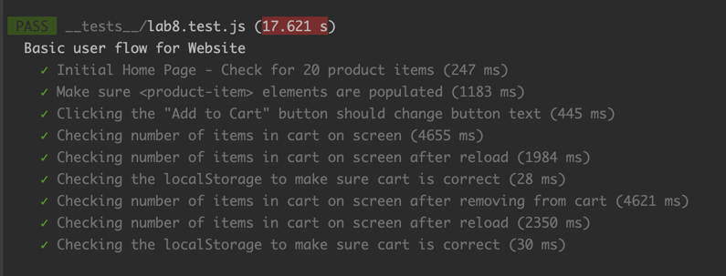
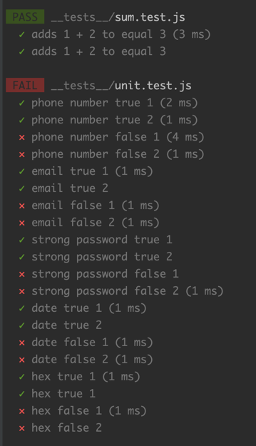

# Lab 8 - Starter
Chaohao Du

1. Answer: 1.
   In the second paragraph of the `intro`, it says
   > automation testing...code getting pushed to the remote repository, or test runs of the whole repo that are
   triggered nightly.

2. Answer: No.
   End to end test emulates user actions. Users don't care about a specific fucntion.
3. Answer: No.
   Message feature requires a user to send a message to another, which is can't be completed by a unit test.
4. Answer: Yes.
   Unit test can check the length of the text that user write.

### Screenshots

